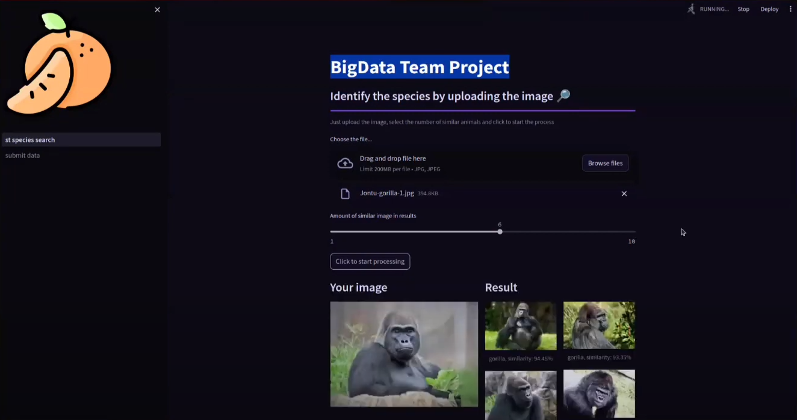

[](https://weaviate.io/) [](https://streamlit.io/)


# Animal Species Search By Image App
Final project for the [Py4BD course.](https://bigdatateam.org/ru/python-for-big-data) 

This application is developed using Streamlit and allows users to upload animal images and find similar images in the database. The app provides a user-friendly interface for visualizing search results and analyzing similarities.





## 📚 Quickstart Guide 

0. Go to our streamlit app running on the [Streamlit Community Cloud.](http://www.example.com)
1. Upload an image of the animal you are looking for.
2. Select the number of similar animals to output in the result.
3. Get a search result!

## Notes

- This application serves as a demonstration and can be adapted to specific project needs.
- API of our database in development.

For your own use, you need to prepare your own embedding base on Weaviate

Set environment variables:
**Set environment variables:**
```
WEAVIATE_URL= YOUR WEAVIATE_CLUSTER_URL
WEAVIATE_API_KEY= YOUR WEAVIATE_API_KEY
```

To set up your Weaviate cluster, follow either of these methods:

- **OPTION 1** Create a cluster in WCS (for more details, refer to the [Weaviate Cluster Setup Guide](https://weaviate.io/developers/wcs/guides/create-instance))
- **OPTION 2** Use Docker-Compose to setup a cluster locally [Weaviate Docker Guide](https://weaviate.io/developers/weaviate/installation/docker-compose)

## 💖 Open Source Contribution
You can improve the animal species search model by submitting datasets of animal images. Please make sure that the species are defined correctly.

The process of submitting a photo:
1. Folders with the Latin (scientific) name of species
2. Photos of animals in .JPG format attached to the corresponding folders
3. Upload the images to Google Drive or any other cloud storage
4. Go to our [Google Form](https://docs.google.com/forms/d/e/1FAIpQLScPs999lGn_cPlfLMHlB9jNZUXgrIwJLTtLG8p8zKsD1bBxJg/viewform?usp=sharing) and fill it out.

## 💾 References
This application is developed based on [a dataset from Kaggle](https://www.kaggle.com/datasets/iamsouravbanerjee/animal-image-dataset-90-different-animals/data)


